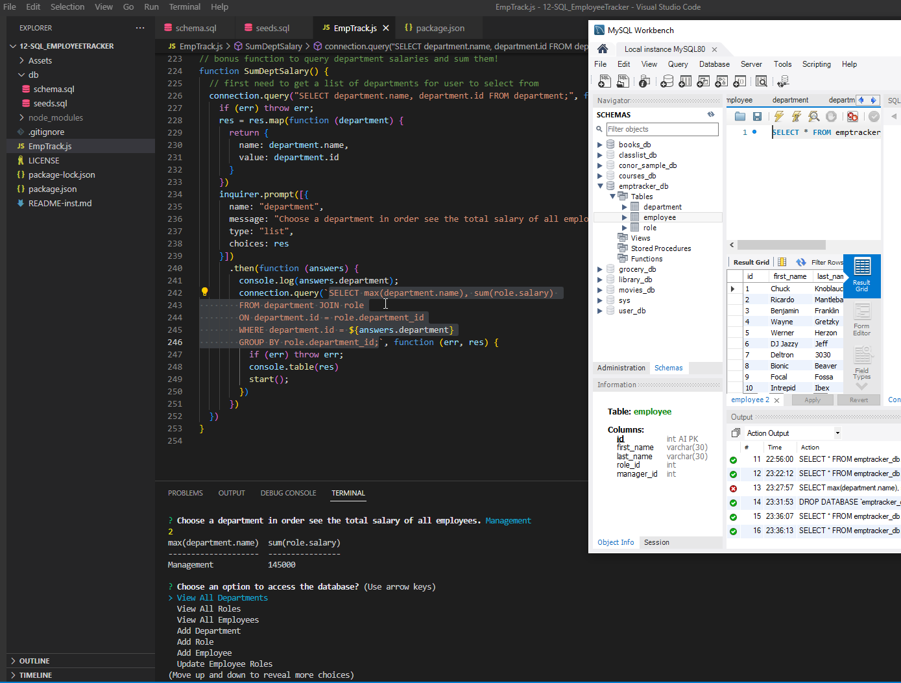

# 12 - Employee Traker using MySQL and Inquirer
# Submitted by Conor Donnelly - November 22, 2022

This challenge required us to create a MySQL database for employee tracking and a Node CLI app using the Inquirer package to view and modify records in the tables.

1st) Write schema.sql that will create the database and empty tables including the fields and field definitions.

2nd) Write seeds.sql that will populate the three tables with some sample data.

3rd) Write a Javascript file that will contain connection info for the database, and inquirer prompts with SQL to view, create and update existing data in the table.

Please click the video link below for a screen share demo of the application in action!

https://drive.google.com/file/d/1fi3lwimdl-c4YoyqDOE3J4TDi30Zgg6P/view

## Screenshot

